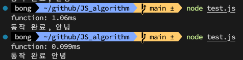

# rendering 이슈?

```javascript
//기존 -> 값이 리턴되기 전에 return 해버림
getWeeklySummary = async(item: any) => {

  let dailyCompletion = [];
  const logs = await this.props.LogStore.getWeeklyLogs();
  let temp = moment(fromDate);
  ...
  내용
  ...
  return dailyCompletion;

  };


// 수정 후 -> 정상 작동
getWeeklyLog = async () => {
    const logs = await this.props.LogStore.getWeeklyLogs();
    return logs;
  };

getWeeklySummary = (item: any) => {

  let dailyCompletion = [];
  const logs = this.getWeeklyLog(fromDate);
  ...
  내용
  ...
  return dailyCompletion;

  };


```

```javascript
// 221208 추가 코드

// Test 1 (코드 내부에서 실행)

const func = async () => {
  const hello = await setTimeout((value) => {
    console.log('동작 완료');
  }, 3000);
};

// Test 2 (코드 외부로 뺐을때)
const fetch = async (value) => {
  const answer = await value;
  setTimeout(() => {
    console.log('동작 완료', answer);
  }, 3000);
};

const func = () => {
  fetch('안녕');
};

console.time('function');
func();
console.timeEnd('function');
```



- 속도 차이 10배 발생
